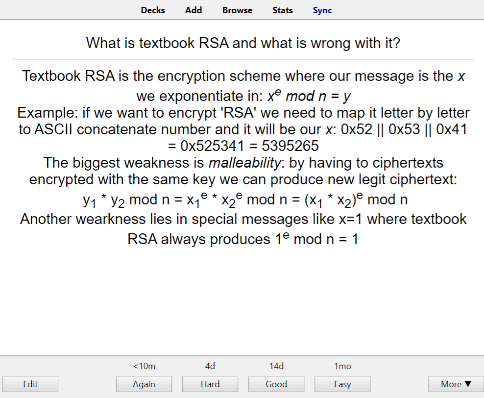
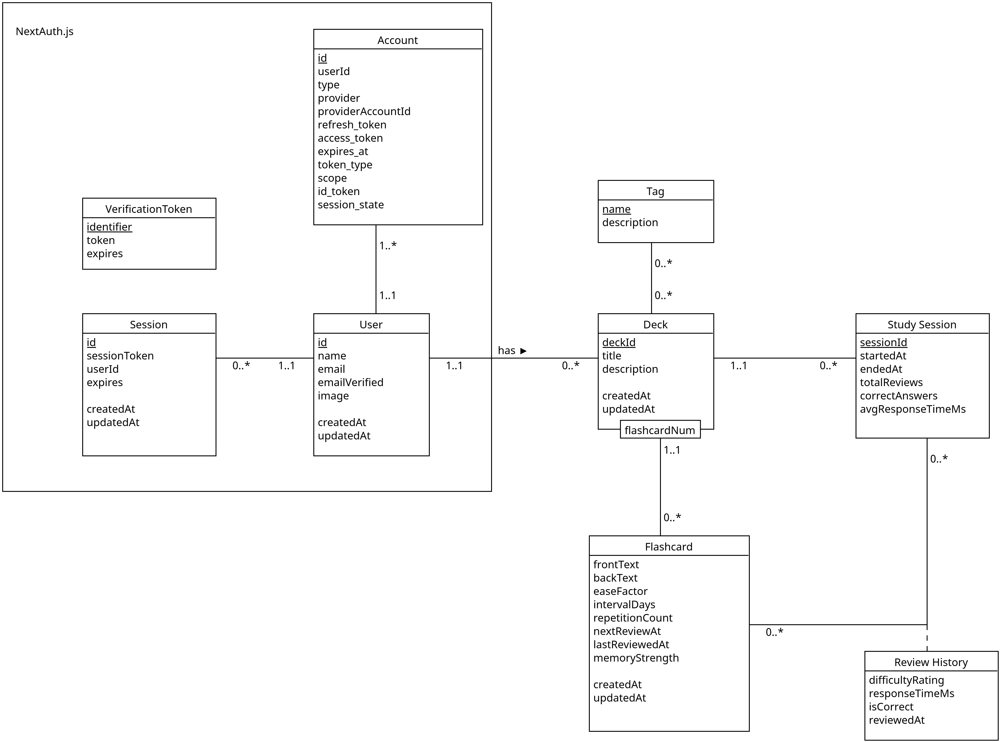
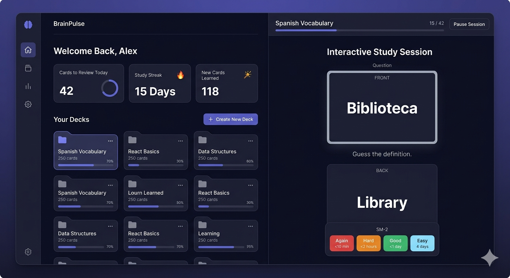
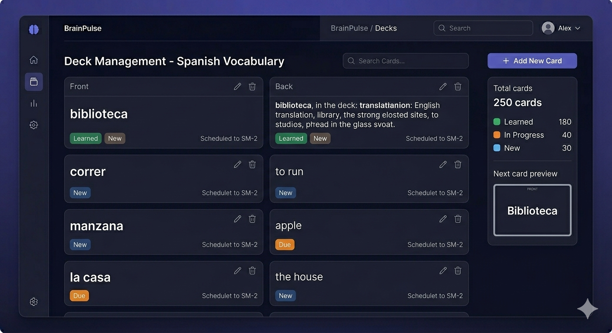
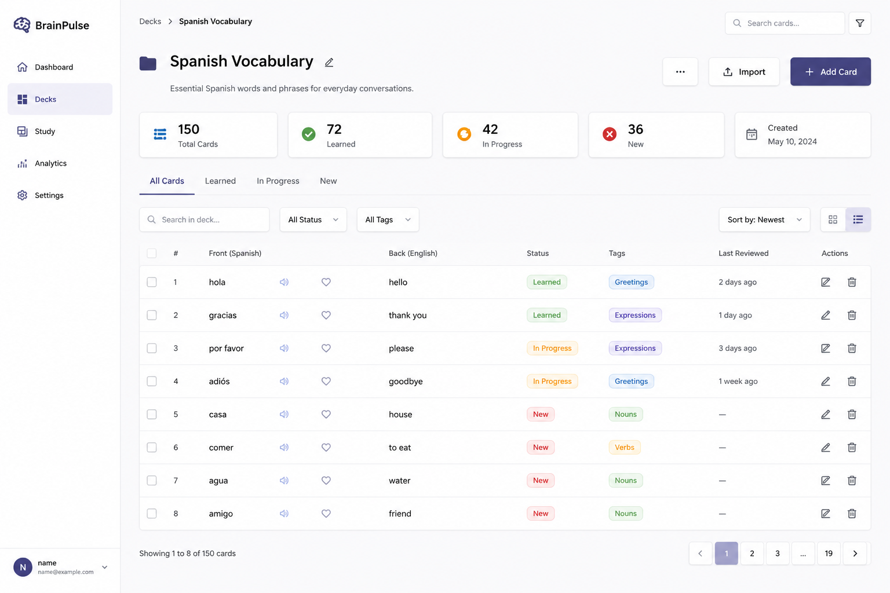
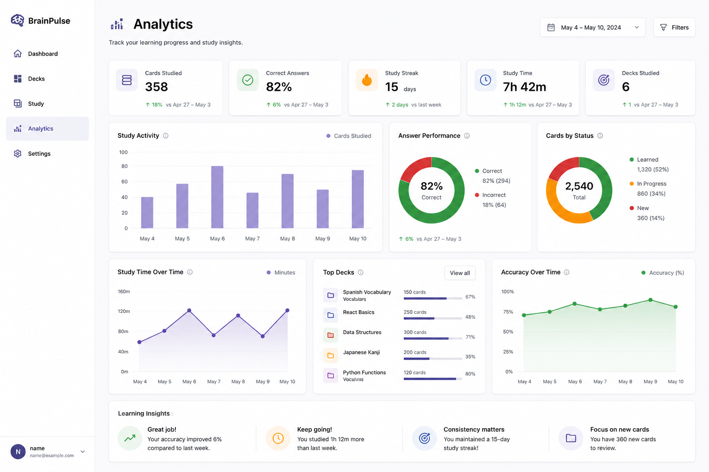

<!-- _class: title -->
<!-- _paginate: false -->
<!-- _header: '' -->
<!-- _footer: '' -->

# Better Flashcards
## Online learning platform based on flashcards method and spiced with spaced repetition

<p>HEIG-VD WEB 2026<br>Makovskyi Maksym</p>

---

<style scoped>
  section {
    display: flex;
    flex-direction: column;
    align-items: center;

    h1,h2,h3,h4 {
      align-self: stretch;
    }
    img {
      border-radius: 5px;
      border: 1px solid var(--dark-blue);
    }
  }
</style>

# Anki as an inspiration source (for features)



---

# From Objectives to Features

<div class="columns">

<div>

#### Objectives

- Create and organize personalized learning materials into structured study decks
- Improve long-term knowledge retention through adaptive repetition and review scheduling
- Track learning progress and identify weak areas over time

</div>

<div>

#### Core Features

- User authentication with identity provider (GitHub)
- Deck and Flashcard management (CRUD ops on decks/cards, cards exclusively include text)
- Adaptive study system (spaced repetition scheduling, SM-2)
- Interactive study mode (guess the other side of a card)
- Learning dashboard (track study progress, view study statistics)

</div>

---

<style scoped>
  section {
    display: flex;
    flex-direction: column;
    align-items: center;

    h1,h2,h3,h4 {
      align-self: stretch;
    }
    img {
      border-radius: 5px;
      border: 1px solid var(--dark-blue);
    }
  }
</style>

# Data Model



---

<style scoped>
  section {
    display: flex;
    flex-direction: column;
    align-items: center;

    h1,h2,h3,h4 {
      align-self: stretch;
    }
  }
</style>


# Generated mockups (Gemini - 1)



---

<style scoped>
  section {
    display: flex;
    flex-direction: column;
    align-items: center;

    h1,h2,h3,h4 {
      align-self: stretch;
    }
  }
</style>

# Generated mockups (Gemini - 2)



---

<style scoped>
  section {
    display: flex;
    flex-direction: column;
    align-items: center;

    h1,h2,h3,h4 {
      align-self: stretch;
    }
    img {
      border-radius: 5px;
      border: 1px solid var(--dark-blue);
    }
  }
</style>

# Generated mockups (ChatGPT - 1)



---

<style scoped>
  section {
    display: flex;
    flex-direction: column;
    align-items: center;

    h1,h2,h3,h4 {
      align-self: stretch;
    }
    img {
      border-radius: 5px;
      border: 1px solid var(--dark-blue);
    }
  }
</style>

# Generated mockups (ChatGPT - 2)



---

# Technologies selection

<div class="columns">

<div class="box">

#### Initially

- Next.js
- MUI
- Zustand
- Motion React
- Prisma
- Sqlite
- NextAuth.js
- Typescript
- SuperMemo 2 (SM-2)

</div>

<div class="box">

#### Currently

<div class="columns">

<div>

- Next.js
- MUI
- ~~Motion React~~
- Zustand
- Prisma
- Sqlite
- NextAuth.js
- Typescript
- ~~SM-2~~

</div>

<div>

- SWR (_new_)
- Zod (_new_)
- Free Spaced Repetition Scheduler (_new_)
- Date-fns (_new_)

</div>

</div>

</div>

</div>


---

# Challenges (1) Types 

#### How to type this whole thing ?


<div class="columns">

<div>

- Use Prisma types generated from models ? Is it enough ?

```js
model StudySession {
  sessionId String @id @default(cuid())
  startedAt DateTime @default(now())
  endedAt DateTime?
  status StudySessionStatusEnum
  totalReviews Int @default(0)
  correctAnswers Int @default(0)
  avgResponseTimeMs Int?
  deckId String
  deck Deck @relation(fields: [deckId], references: [deckId])
  createdAt DateTime @default(now())
  updatedAt DateTime @updatedAt
  reviewedCards ReviewHistory[]
}

```

</div>

<div>

- Not really

```js
// study-store.ts:68
const session: StudySessionModel = await fetch(
    '/api/session/start',
    {
        method: 'POST',
        body: JSON.stringify({ deckId: selectedDeck?.deckId }),
    }).then(res => {
        if (!res.ok) {
            throw new Error(`Failed to create new session for deck with id=${selectedDeck?.deckId}`)
        }
        return res.json()
    })
// session.startedAt is string and not a Date
// session.status is string and not enum
```

- What to do ? The answer is **Zod**

</div>

</div>

---

# Challenges (2) Types

#### Zod

<div class="columns">

<div>

- Define Zod schema for `StudySession`

```js
// study-session-schema.ts
export const StudySessionSchema = z.object({
    sessionId: z.string(),
    startedAt: z.coerce.date(),
    endedAt: z.coerce.date().nullable(),
    status: ???,
    totalReviews: z.number(),
    correctAnswers: z.number(),
    avgResponseTimeMs: z.number().nullable(),
    deckId: z.string(),
    createdAt: z.coerce.date(),
    updatedAt: z.coerce.date()
})
```

</div>

<div>

- What is up with `status` ?

```js
// schema.prisma
enum StudySessionStatusEnum {
  STARTED
  PAUSED
  FINISHED
}
```

- Simple use `z.enum`

```js
export const StudySessionStatusSchema = z.enum(StudySessionStatusEnum)
```

- Finally, use `StudySessionSchema`

```js
// later in study-store.ts:73
then(res => {
  if (!res.ok) {
    throw new Error(`Failed to create new session for deck with id=${selectedDeck?.deckId}`)
  }
  return res.json()
}).then(s => StudySessionSchema.parse(s))
```

</div>

</div>

---

# Challenges (3) Data fetching 1

<div class="columns">

<div>

- Given this endpoint, how would you fetch data ?

| Endpoint          | Description                                  |
|-------------------|----------------------------------------------|
| `GET  /api/decks` | Returns all the decks with flashcards inside |

Returned type:

```js
export type EnhancedDeckModel = DeckModel & { flashcards: FlashcardModel[] }
```

- Would you use `fetch`, `useEffect` and `useState`/`Context` ?

- There is something better ?

</div>

<div>

- Yes, **SWR**. It does everyhing above + data (re-)validation

```js
// _hooks/use-all-decks.ts
const { data, error, isLoading, isValidating, mutate } = 
  useSWR<EnhancedDeckModel[], Error>(
    '/api/decks',
    (url: string) => generalGetFetcher(url)
        .then(obj => EnhancedFlashcardsDeckArraySchema.parse(obj) as EnhancedDeckModel[])
  )
```

- But then the real challenge arises - pre-fill client component on the server
_Note (from https://react.dev/reference/rsc/use-client)_:
  - Client Components are components in a render tree that are rendered on the client.
  - Server Components are components in a render tree that are rendered on the server

</div>

</div>


---

# Challenges (3) Data fetching 2

<div class="columns">

<div>

#### Pre-filling data for SWR

It can be solved by fetching data in server component and passing promise as fallback data to client component, in this way entry in cache referenced by `url` used to fetch data is already prefilled when client component calls `useSWR`

</div>

<div>

- Server Component
```js
export default async function DecksPage() {
  // ...
  const decksPromise: Promise<EnhancedDeckModel[]> = prisma.deck.findMany({
      where: { userId: session.user?.id },
      include: { flashcards: true }
  })
  return (
      <SWRConfig
          value={{
              fallback: {
                  '/api/decks': decksPromise,
              },
          }}
      >
          <AllDecksWorkspace />
      </SWRConfig>
  )
}
```

</div>

</div>


---

# It is demo time !

---

# Specification

### What has or has not been done according to intial design document ?

<div class="columns">

<div class="box">

#### Technologies

| Name               | Reason                                                                                                      |
|--------------------|-------------------------------------------------------------------------------------------------------------|
| React Motion       | Material design guideliness advises against Card flipping as method to reveal card content                  |
| SuperMemo 2 (SM-2) | Obsolete (1987) and not really appearing (you should wait a day for repeat card that you don't know at all) |

</div>

<div class="box">

#### Features

Reason is one - I've run out of time.

- Deck information editing
- Deck deletion
- (*) Filtering and Searching through collection of Decks/Cards
- (*) No way to update the algorithm settings from UI

_(*) was not a part of initial design document but can be considered this way_

</div>

</div>

---

# Further development

- Proper errors display
- Cards can include the images and rich text
- Tags
- Filtering and search
- Session details
- More study modes (pair it/choose it/type it)
- Public/private decks 
- More charts and analytics data for dashboard (example: Knowledge Graph Visualization of related cards among related decks)
- Replay previous study session
- Shared decks

---

# Thank you for your attention !

